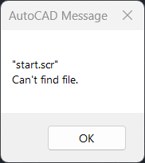

# Create a custom template for AutoCAD plugin development in .NET 
Starting a new project can take up some unnecessary time. You could start from scratch or use a template and start coding, but you realize that you could be copying code from a previous project. A custom template could be a good idea to create a quick and consistent starting point of your project.

This tutorial will focus on making an AutoCAD plugin template package, but whether you are here for the AutoCAD part or just want to understand the templates for .NET, following this tutorial will enable you to create complex templates using basic building blocks.

### Prerequisites
- A basic understanding of programming and using the terminal. This tutorial focuses on a C# AutoCAD plugin, but you will not be doing a lot of programming.
- An AutoCAD installation. Everything you will be doing also works for the trial version.
- This tutorial uses Rider as a code editor, but feel free to use any IDE. You can even use a text editor with a terminal. 

## Basic Templates
In the first part of this tutorial, you create a very basic yet powerful template. You will get to understand the template.json file and add your first files to the template. Finally, you create a package of your template to save it for yourself or share it with others and along the way you will pick up some tricks that help debugging with AutoCAD a lot more efficient.

### The backbone of a template
There is one key element that all templates need: The `template.json` file. It contains all the configuration data for the implementation of your template. Once this file is added to a `.template.config` folder, .NET will be able to understand that the files and folders that are in the same folder as the .template.config folder belong to a template. Let's create an example template without using any code editor.

[comment]: <> (tree signs: │ ├─── └───)
```
Autocad.Template.Basic
└───.template.config 
    │   template.json
```

1. Create a folder called `Autocad.Template.Basic` anywhere you like.
2. Add a `.template.config` folder to it.
3. Open a text editor and add the json styled text below. Change the details to your preferences (definitions [here](https://learn.microsoft.com/en-us/dotnet/core/tools/custom-templates)). Most of them do not need clarification, but you will explore the important once later on in this tutorial. To keep things clear: the `sourceName` should have the same value as the folder name in step 1.
    ```json
    {
      "$schema": "http://json.schemastore.org/template",
      "author": "Luc van Dijk",
      "classifications": [ "Autocad", "Plugin" ],
      "identity": "AutocadTemplateBasic",
      "name": "Autocad Template",
      "shortName": "ac-temp",
      "sourceName": "Autocad.Template.Basic",
      "preferNameDirectory":true,
      "tags": {
        "language": "C#",
        "type": "project"
      }
    }
    ```
4. Save the file as `template.json` to the `.template.config` folder

You now have the previously shown file structure and that means that you have created our very first template. Quickly test it by opening a terminal, go in the directory of `...\Autocad.Template.Basic`. Now run the command `dotnet new install .` and your template is ready for use. By doing a `dotnet new list` your template should be there. Another way is to open a code editor, create a new project and then find the new template between the other templates. 


Notice that by creating an implementation of the template, the `.template.config` folder has disappeared. This is the default behaviour of a template.

You will be updating the template quite a bit in this tutorial. In order to see the changes, reinstall and then open a new project:

- Run `dotnet new uninstall .` in your template folder to uninstall.
- Run `dotnet new install .` in your template folder to install.
- Create a new project with the updated template.


### Adding files/folders to a project template
The next step is adding more structure and some files to a project. Creating AutoCAD plugins can be made significantly easier if you set up a couple of files that launch AutoCAD and load the plugin file. It is also necessary to connect to the AutoCAD programming interface by having a `.csproj` that includes the dependencies.

Let's start by adding a `.csproj`.

1. To connect to the AutoCAD API, you need to install the right version of [AutoCAD ObjectARX](https://aps.autodesk.com/developer/overview/objectarx-autocad-sdk). The download link is hidden behind the button "View license agreement". Download it and place it in a convenient place on your computer. For this tutorial you will be using a couple of `.dll` files in the `inc` folder. 
2. Open a text editor and add the following xml code:
    ```xml
    <Project Sdk="Microsoft.NET.Sdk">
    
        <PropertyGroup>
            <TargetFramework>net8.0</TargetFramework>
            <ImplicitUsings>enable</ImplicitUsings>
            <Nullable>enable</Nullable>
            <RootNamespace>Autocad.Template.Basic</RootNamespace>
        </PropertyGroup>
        
        <ItemGroup>
            <Reference Include="accoremgd">
                <HintPath>C:\Autocad 2026 ObjectARX\inc\AcCoreMgd.dll</HintPath>
                <Private>False</Private>
            </Reference>
            <Reference Include="Acdbmgd">
                <HintPath>C:\Autocad 2026 ObjectARX\inc\AcDbMgd.dll</HintPath>
                <Private>False</Private>
            </Reference>
            <Reference Include="acmgd">
                <HintPath>C:\Autocad 2026 ObjectARX\inc\AcMgd.dll</HintPath>
                <Private>False</Private>
            </Reference>
        </ItemGroup>
    
    </Project>
    ```
4. Change the `RootNamespace` to the value of `sourceName` in the `template.json` file. This is important because every instance of this value will be replaced to the _name of the implementation of the template_, which is really handy. This will become clear after reinstalling the template. 
5. Change the paths of the references to `accoremgd.dll`, `Acdbmgd.dll` and `acmgd.dll` to where they are located on your device.
6. Save the file as `Autocad.Template.Basic.csproj` to the `Autocad.Template.Basic` folder.


Reinstall your template like earlier and then create a project with the template that is called `TestSourceName` for example. When you inspect the project you will see the following changes:
- `Autocad.Template.Basic.csproj` -> `TestSourceName.csproj`
- `<RootNamespace>Autocad.Template.Basic</RootNamespace>` -> `<RootNamespace>TestSourceName</RootNamespace>`


Pretty useful, right? 

We can remove this dummy project and start working in a code editor now. Pick one you like, and open the `Autocad.Template.Basic.csproj` in this editor.

Since the `.template.config` was not indexed with the project, it might not be visible in your code editor. You want to keep the indexing the way it is, but you can still edit the file by clicking on the `Show all files` in the solution tree in your IDE.

#### Adding a launch profile
If you are creating .NET projects, you want to explain the compiler what you mean with "debugging". For example, you probably want to start the Autocad application whenever a debug is started. This is done in a launch profile, and you could add it to your project every time you create a plugin, but why not make this easy?

1. Add a `Properties` folder to the project.
2. Add a file called `launchSettings.json` to this folder. In this file you can add 1 or more profiles that will be available when debugging.
3. Add the following example profile to the new file, but change the `executablePath` to the path of your `acad.exe` location. Feel free to add other profiles.
    ```json
    {
      "profiles": {
        "Autocad 2026": {
          "commandName": "Executable",
          "executablePath": "C:\\Program Files\\Autodesk\\AutoCAD 2026\\acad.exe",
          "commandLineArgs": "/nologo /b \"start.scr\""
        }
      }
    }
    ```

Instead of creating a new project to test our templates, just launch the template itself. Even the new launch profile is available and is called `Autocad 2026`. Run the template and notice that Autocad is now launching.


Once AutoCAD has started, it will report that the "magical" `start.scr` that was mentioned in the `commandLineArgs` is not found. What is this file?



#### Adding a start.scr

Whenever you want to load a plugin, you have to run a command in AutoCAD. This means that every time you want to try its latest feature of your plugin, you have to manually do this. This process can and should be automated by you. The command in AutoCAD is `NETLOAD "<YourPlugin.dll>" ` and when placed in the `.scr` file and update to the output folder, you can run this script via the `commandLineArgs` in the `launchsettings.json`. Follow along if this sounds like abracadabra to you.

1. Add a file called `start.scr` to the project. Open the file and add

   ```
   NETLOAD "Autocad.Template.Basic.dll" 
   ``` 
   **There needs to be a space at the end** and recognize that this uses the sourceName-replacing-trick again.
2. To copy this `start.scr` to the output folder for debugging, add an item group to the `Autocad.Template.Basic.csproj`. It should now look like this:
```xml
<Project Sdk="Microsoft.NET.Sdk">

    <PropertyGroup>
        <TargetFramework>net8.0</TargetFramework>
        <ImplicitUsings>enable</ImplicitUsings>
        <Nullable>enable</Nullable>
        <RootNamespace>Autocad.Template.Basic</RootNamespace>
    </PropertyGroup>
    
    <ItemGroup>
        <Reference Include="accoremgd">
            <HintPath>C:\Autocad 2026 ObjectARX\inc\AcCoreMgd.dll</HintPath>
            <Private>False</Private>
        </Reference>
        <Reference Include="Acdbmgd">
            <HintPath>C:\Autocad 2026 ObjectARX\inc\AcDbMgd.dll</HintPath>
            <Private>False</Private>
        </Reference>
        <Reference Include="acmgd">
            <HintPath>C:\Autocad 2026 ObjectARX\inc\AcMgd.dll</HintPath>
            <Private>False</Private>
        </Reference>
    </ItemGroup>

    <ItemGroup>
        <None Update="start.scr">
            <CopyToOutputDirectory>Always</CopyToOutputDirectory>
        </None>
    </ItemGroup>

</Project>
```
Run the template and now AutoCAD opens and there should be a pop-up asking you if you want to load the plugin (accept or always accept it, it doesn't matter for now). The final check is that there is always a message in the command line of AutoCAD:


If it does not work you should run `LEGACYCODESEARCH` in AutoCAD and make sure that is set to `ON`. This enables external files to be loaded add startup. You can now simply restart the debugging session and the message will be there.


Hint: In the same way you can set `SECURELOAD` to `FALSE` to not get the pop-up asking if you want to load your plugin. Use this setting only while debugging.

#### Adding the Active class & Commands class
There are lots of things you can do when programming for AutoCAD, but there is a big chance that you are here to create new custom commands. For the creation of these commands, you will encounter a couple of objects that let you manipulate AutoCAD:

- The active document
- The active editor
- The active database

Active means that this is the part of the program that the user is interacting with. You could also work with inactive documents for example. The starting point of you plugin is almost always in the active workspace, so you could at some infrastructure to interact with these objects. This idea comes from a [class of Ben Rand](https://www.autodesk.com/autodesk-university/class/Create-Your-First-AutoCAD-Plug-2020#video), showing an example of an AutoCAD plugin. If it doesn't make sense jet, just follow along. Everything will become clear once you see a simple example.

Create a new file in the project called `Active.cs` and add the follow code:
```csharp
using Autodesk.AutoCAD.ApplicationServices;
using Autodesk.AutoCAD.DatabaseServices;
using Autodesk.AutoCAD.EditorInput;

namespace Autocad.Template.Basic;

public static class Active
{
   public static Document Document 
      => Application.DocumentManager.MdiActiveDocument;
   
   public static Editor Editor 
      => Document.Editor;
   
   public static Database Database 
      => Document.Database;
}
```
Again, the namespace name in this file will be changed, like you have seen a couple of times by now.

This class makes accessing the active objects a little bit simpler. For example, accessing the editor to write a message in the command line in AutoCAD is normally done by:

`Application.DocumentManager.MdiActiveDocument.Editor.WriteMessage("\nHello, World!")`

And now becomes:

`Active.Editor.WriteMessage("\nHello, World!")`

Another useful file to add is a `Commands.cs` file containing a class that collects all the commands you will create. These commands have an attribute called CommandMethod that will do all the setup for you to run it from the command line in AutoCAD. There are a couple of parameters that this attribute can have, but that is beyond the scope of this tutorial. This is an example of the `Commands.cs` file:
```csharp
using Autodesk.AutoCAD.Runtime;

namespace Autocad.Template.Basic;

public class Commands
{
   [CommandMethod("Test")]
   public static void Test()
   {
      Active.Editor.WriteMessage("\nHello, World!");
   }
}
```
This very simple method will run when the user types `Test` in AutoCAD, resulting in a "Hello, World!" appearance in the editor.


### Packaging
Great! This is already a good template for personal use. To share this requires you to package your template. A package can contain a multiple templates, and it needs a special `.csproj` file that is styled in a way that .NET knows how to pack. It should be located at the same level as the folders of the templates. Here is an example of such a folder structure with 2 templates.
```
Autocad.Templates
├───Autocad.Templates.csproj
└───Templates
    ├───Template1
    │   ├───.template.config 
    │   │   └───template.json
    │   │
    │   ├───file1.cs
    │   ...
    │   
    └───Template2
        ├───.template.config 
        │   └───template.json
        │
        ├───file1.cs
        ...
```
For now, you only have 1 template, but you have to pack it like this anyway. The good thing about this is of course that you can add as many templates to this package as you like. So:

1. Create a new folder called "Autocad.Templates" or whatever you think is a good name for you package.
2. Add a `Autocad.Templates.csproj` file to this folder like you did in the beginning of this tutorial. It should contain the following code, but feel free to make it to your likings:
   ```xml
   <Project Sdk="Microsoft.Net.Sdk">
       
       <PropertyGroup>
           <PackageType>Template</PackageType>
           <PackageVersion>1.0</PackageVersion>
           <PackageId>Lucs.Autocad.Templates</PackageId>
           <Title>Autocad plugin template for C#</Title>
           <Authors>Luc van Dijk</Authors>
           <Description>A template for creating a new Autocad plugin using C#</Description>
           <PackageTags>templates;plugin;AutoCAD</PackageTags>
           <TargetFramework>net8.0</TargetFramework>
           
           <IncludeContentInPack>true</IncludeContentInPack>
           <IncludeBuildOutput>false</IncludeBuildOutput>
           <ContentTargetFolders>content</ContentTargetFolders>
       </PropertyGroup>
       
       <ItemGroup>
           <Content Include="Templates\**\*" Exclude="Templates\**\bin\**;Templates\**\obj**" />
           <Compile Remove="**\*" />
       </ItemGroup>
   </Project>
   ```
   Here is a quick overview of the most important features:
   - PackageType is "Template", letting the compiler know what to expect.
   - PackageId is the name that the user of you package calls to install all the templates in the package.
   - PackageTags helps users on NuGet find you package.
   - The ItemGroup at the bottom removes all the `bin` and `obj` folders from the package. These get created when you work on your template in a code editor.
3. Create a folder called `Templates` in the `Autocad.Templates` folder. This folder contains all the templates that you have in the package.
4. Copy and paste the `Autocad.Template.Basic` project to this `Templates` folder. You might need to save and close it first in you IDE.

This should now be the structure of you template:
```
Autocad.Templates
├───Autocad.Templates.csproj
└───Templates
    └───Autocad.Template.Basic
        ├───Autocad.Template.Basic.csproj
        │
        ├───.template.config 
        │   └───template.json
        │
        ├───Properties
        │   └───launchSettings.json
        │
        ├───Active.cs
        ├───Commands.cs
        └───start.scr

```
You are ready for packaging:
1. Open any terminal.
2. Go in the `Autocad.Templates` folder
3. Run `dotnet pack`

Don't worry about the warnings you, but check if the build succeeded. Find your new, sharable, NuGet package in the `bin/Release/net8.0` folder of this project. To install the package, change the following command to have the right path to your `.nupkg` file and run it in the `Autocad.Templates` folder:

`dotnet new install .\bin\Release\Lucs.Autocad.Templates.1.0.0.nupkg`

For testing purposes you can always uninstall the package and then package and reinstall it by doing the following steps:
1. `dotnet new uninstall <package id>`
2. `dotnet pack` in the folder of you package.
3. `dotnet new install <path\to\file.nupkg>`


Here is the file structure of the package:


## Advanced Templates
Since you now have a nice template, you could 
work on a new Autocad Plugins, but there is a lot more that you can do with templates. By adding more flexibility to your template, you prevent the creation of a lot of branches of really similar templates. It is easy go to far with adding flexibility and arrive at a point where setting up the template is more complicated than starting from scratch. Keep it general and to the point, so it is useful for a lot of cases. 

Hint: if you want to work on one template in your package is better to only have that template open to be able to live debug your template. In the rest of the tutorial you will be repackaging, because you will be working on setting some metadata for the templates that requires you to implement the template every time.

### Adding symbols
If you are fixing a problem in a specific drawing, it would be nice to have an option where a drawing (`.dwg` file) automatically starts when you debug your plugin. For example, you are working on a plugin that collects all the text objects in a drawing, and saves the values to a database. It would be nice to open AutoCAD with a drawing containing a couple of text objects, so you can start testing it straight away. 

Open AutoCAD and create a new file. Save it as, for example, `debug.dwg` to the template folder.

You now need to create a parameter that the user of the template can enable and disable to include or exclude the debug drawing. The `template.json` has options to do this. 

First, add a new item that is called `symbols`. Symbols are variables of a template that can be derived, computed, generated or given as a parameter by the user of the template. Let's use the last one. Add a parameter that is called "includeStartUpDrawing" which is a boolean value that is set to "false" by default. Here is the changed `template.json`

```json
{
   "$schema": "http://json.schemastore.org/template",
   "author": "Luc van Dijk",
   "classifications": [ "Autocad", "Plugin" ],
   "identity": "AutocadTemplateBasic",
   "name": "Autocad Template",
   "shortName": "ac-temp",
   "sourceName": "Autocad.Template.Basic",
   "preferNameDirectory":true,
   "tags": {
     "language": "C#",
     "type": "project"
   },
   "symbols": {
      "includeStartUpDrawing": {
         "type": "parameter",
         "dataType": "bool",
         "defaultValue": "false",
         "displayName": "Include start up drawing",
         "description": "Includes a .dwg file that always starts when debugging."
      }
   },
   "sources": [
      {
         "modifiers": [
            {
               "condition": "(!includeStartUpDrawing)",
               "exclude": ["debug.dwg"]
            }
         ]
      }
   ]
}
```
Notice the new symbol, but also a new `sources` item. This is a list where you can add conditions to specific sources (folders) in our project. By default, you work in the project folder, but you can also target specific folders using a `source`. 

For now, you just want to remove a file conditionally from the main source, so you add a `modifiers` list with a `condition`. The result of the condition is to `exclude` the `debug.dwg`. You can discover more about `sources` and in the [reference guide](https://github.com/dotnet/templating/wiki/Reference-for-template.json).

When you, after packing and reinstalling, create a new project with your template in your IDE, there is an option in the "Advanced Settings" section that has our new checkbox.


### Adding conditional pieces of code
Having a just a checkbox and then removing a file is nice, but it is not enough: you still need to add 2 pieces of code to make it work. Let's dive in:

1. Updating the launch settings

   In order to start this new drawing file, you want to add the name of the file to the `commandLineArgs` in the `launchSettings`, but only when `includeStartUpDrawing` is set to true. This is where it gets weird: you have to use syntax that is specific for templates and on top of that depends on the file that you are working on. [here](https://github.com/dotnet/templating/wiki/Conditional-processing-and-comment-syntax) is a guide for conditionally formatting your templates with various file types. Implement an if-else statement that starts AutoCAD either with or without the `debug.dwg`:
   ```json
   {
     "profiles": {
       "Autocad 2026": {
         "commandName": "Executable",
         "executablePath": "C:\\Program Files\\Autodesk\\AutoCAD 2026\\acad.exe",
         //#if (includeStartUpDrawing)
         "commandLineArgs": "\"debug.dwg\" /nologo /b \"start.scr\""
         ////#else
         "commandLineArgs": "/nologo /b \"start.scr\""
         //#endif
       }
     }
   }
   ``` 
    Don't worry about the big red and yellow lines that your code editor places below the newly added lines. The problem is that `.json` files do not have commenting available and does not allow duplication, though when you implement this template, the "comments" and duplication problems will be gone.


2. Updating the `.csproj` file

   The same goes for the `Autocad.Template.Basic.csproj`: you conditionally include a section that copies the `debug.dwg` file over to the output folder. Again, use [this](https://github.com/dotnet/templating/wiki/Conditional-processing-and-comment-syntax) as a reference for creating these if-statements, but now look for the `xml` file conditions.

   ```xml
   <Project Sdk="Microsoft.NET.Sdk">
   
       <PropertyGroup>
           <TargetFramework>net8.0</TargetFramework>
           <ImplicitUsings>enable</ImplicitUsings>
           <Nullable>enable</Nullable>
           <RootNamespace>Autocad.Template.Basic</RootNamespace>
       </PropertyGroup>
   
       <ItemGroup>
           <Reference Include="accoremgd">
               <HintPath>C:\Autocad 2026 ObjectARX\inc\AcCoreMgd.dll</HintPath>
               <Private>False</Private>
           </Reference>
           <Reference Include="Acdbmgd">
               <HintPath>C:\Autocad 2026 ObjectARX\inc\AcDbMgd.dll</HintPath>
               <Private>False</Private>
           </Reference>
           <Reference Include="acmgd">
               <HintPath>C:\Autocad 2026 ObjectARX\inc\AcMgd.dll</HintPath>
               <Private>False</Private>
           </Reference>
       </ItemGroup>
   
       <ItemGroup>
           <None Update="start.scr">
               <CopyToOutputDirectory>Always</CopyToOutputDirectory>
           </None>
   
           <!--#if (includeStartUpDrawing) -->
           <None Update="debug.dwg">
               <CopyToOutputDirectory>Always</CopyToOutputDirectory>
           </None>
           <!--#endif -->
       </ItemGroup>
   
   </Project>
   ```

Save everything, package and then reinstall the template.

If you followed along, your template now has the following features:
- Starting AutoCAD with an optional test file when debugging.
- Loading the newly compiled `.dll` in AutoCAD.
- The basic infrastructure to interact with AutoCAD.
- A placeholder method for quickly testing if everything is ready for your coding.
- A package that can be easily shared.

## Reflecting on your templates
When building new features for your template, you should be careful to not overcomplicate the template. It is a balancing act between having an indepth and complex template versus a general-purpose and easy template. Keep it to the point as much as possible. Is this new feature an often reoccurring thing? Does this make it easier than starting of from scratch? What do you or the users really need to get out of this feature? 

## Conclusion
Custom templates for .NET projects like AutoCAD plugins can help to start your project faster and more consistent. The template created in this tutorial shows how you can easily add files, get inputs from the user of the template and turn files and pieces of code on and off, but there is a lot more to explore. Prevent writing reoccurring code, while maintaining an easy-to-use template. It is now time to explore by creating your own templates. 


